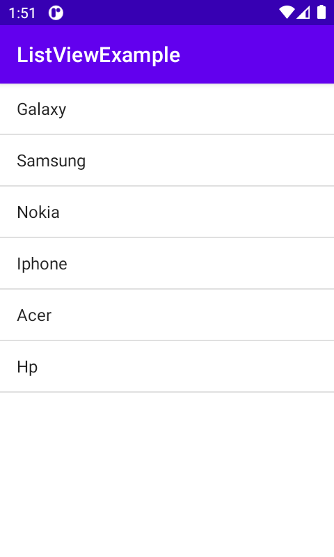

##ListView Tutorial

Thus is a simple project that will guide developers seeking to learn list views

##Screenshots

## Setup And Intallation
For users, just download the app on your Android device and you are good to go.a
For developers, clone the app from the following link https://github.com/JAPHETHNYARANGA/nyaranga-listView.git and open it in intellij or Android studio

##Technologies

* Android Os
* Java

# Contact
email the developer on nyaranga4@gmail.com.a

## License
this project is under MIT license.